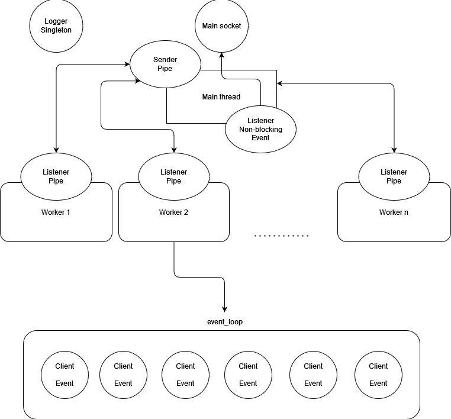

# Static web-server based on [Libevent](https://libevent.org/)

## Brief details

- **Language:** C++
- **Architecture:** polling + threads
- **Author:** Albert Kashapov (zenehu)

## Usage

### Makefile

Commands:

```shell
make build                          # Build server
make run                            # Run server
make clear                          # Clear build directory
make docker_build_server            # Docker build server
make docker_start_server            # Run server container
make docker_start_nginx             # Run nginx container
make docker_run_it_server           # Docker run server in interactive mode
make perf_test_server_ab            # Run ab performance test for server
make perf_test_server_wrk           # Run wrk performance test for server
make perf_test_nginx_ab             # Run ab performance test for nginx
make perf_test_nginx_wrk            # Run wrk performance test for nginx
make benchmark_server               # Reload benchmark for server
make benchmark_nginx                # Reload benchmark for nginx
make help                           # Get commands help
```

### Config

- **Default path:** `/etc/httpd.conf`
- **Configs for benchmarks:** `benchmarks/{server,nginx}/*.conf`

```c++
cpu_limit 8 # maximum CPU count to use (for non-blocking servers)
document_root /var/www/html
port 80 # port to listen on
debug false # debug mode
```

### Project arguments

The highest priority than in the config

`./static_web_server {num_threads}`

### Benchmarks

- Apache HTTP server benchmarking tool (ab)
- wg/wrk

Both results are in `benchmark` directory

Here are the results of load testing against nginx:

> Environment: docker/ubuntu (both)
>
> Configuration: 2, 4, 8, 16 workers
>
> Test file size: 938 Kb

**Commands:**

```shell
ab -n 20000 -c 250 127.0.0.1:{port}/httptest/wikipedia_russia.html
wrk --latency -d30s http://127.0.0.1:{port}/httptest/wikipedia_russia.html
```

| Count workers | Nginx RPS | **Server RPS** |
|---------------|-----------|----------------|
| 2             | 296.46    | **473.38**     |
| 4             | 477.70    | **493.17**     |
| 8             | 476.36    | **484.40**     |
| 16            | 476.03    | **482.73**     |

More workers could have been put in, but the results show that the socket resources are already insufficient

Let's take the best RPS's of both:

**Difference in RPS:** 476.36 (Nginx) / 493.17 (Server) = **0.96**

### Architecture

1. Main thread catches client connections in event_loop.
2. Send client descriptor to preferred worker by pipe_fd.
3. Workers are selected one at a time (round-robin).
4. The worker's "listener" then adds the client as an event to its event_loop to process the request asynchronously.
5. After execution, the request is sent back to the client socket.



